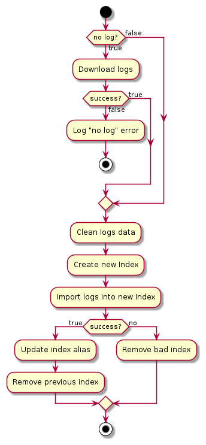
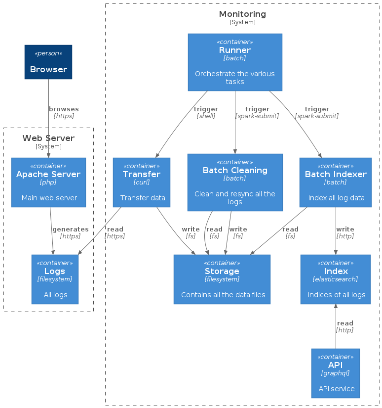

# Requirements

## Context

A web server is generating logs. 
The goal is to process the logs so that they can be indexed into an elastic search. 

## Global architecture

The business architecture implements two systems, a web server system and a monitoring system. 

## Batch

A batch processes the webserver logs.

The steps are the following:

# Design

## Detailed Architecture

